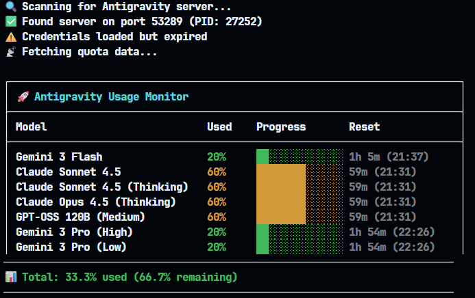

# Antigravity Usage Checker

🌐 [🇻🇳 Tiếng Việt](#vietnamese) | [🇬🇧 English](#english)

🚀 Check your Antigravity AI usage quota from terminal


[](https://github.com/tungcorn/antigravity-usage-checker/actions/workflows/ci.yml)
[](https://github.com/tungcorn/antigravity-usage-checker/actions/workflows/codeql.yml)



## 🔒 Security

This tool is designed to be transparent and safe:

- ✅ **Local only** - Only connects to `localhost` (Antigravity local server)
- ✅ **No network calls** - Does NOT send any data to external servers
- ✅ **No telemetry** - No tracking, analytics, or data collection
- ✅ **Open source** - All code is public and auditable
- ✅ **CodeQL scanned** - Automatically scanned for security vulnerabilities

> 💡 You can review the [install scripts](install.ps1) before running them.

## 🔧 How It Works

1. Detects the running Windsurf language server process
2. Extracts connection parameters (port, CSRF token) from process arguments
3. Calls the local API at `127.0.0.1` to fetch quota data
4. Parses and displays the information in terminal

> **Note**: This tool only reads publicly available process information and communicates with localhost. No external network requests are made.

## ⚠️ Known Limitations

**Quota Precision**: The Antigravity Local API typically updates usage statistics at specific milestones (e.g., 0%, 20%, 40%, 60%, 80%).
- This is a limitation of the local API that this tool relies on.
- Other tools (like *OpenCode*) may show more granular percentages by hooking directly into the IDE's internal event stream or CLI token counter, which is a different approach than the safe, read-only API method used by this tool.

---
<a id="english"></a>
## 🇬🇧 English

### Quick Install

**Windows (PowerShell):**
```powershell
iwr https://raw.githubusercontent.com/tungcorn/antigravity-usage-checker/main/install.ps1 -OutFile $env:TEMP\install.ps1; . $env:TEMP\install.ps1
```

**macOS / Linux (Bash):**
```bash
curl -fsSL https://raw.githubusercontent.com/tungcorn/antigravity-usage-checker/main/install.sh | bash
```

Then run:
```bash
agusage
```

### Update

Run the install command again to update to the latest version.

### Install Specific Version

**Windows:**
```powershell
iwr https://raw.githubusercontent.com/tungcorn/antigravity-usage-checker/main/install.ps1 -OutFile $env:TEMP\install.ps1; . $env:TEMP\install.ps1 -Version 0.5.0
```

**macOS / Linux:**
```bash
curl -fsSL https://raw.githubusercontent.com/tungcorn/antigravity-usage-checker/main/install.sh | bash -s -- -v 0.5.0
```

### Manual Install

1. **Download** from [Releases](https://github.com/tungcorn/antigravity-usage-checker/releases/latest)
   - Windows: `antigravity-usage-checker-windows-amd64.zip`
   - macOS Intel: `antigravity-usage-checker-darwin-amd64.tar.gz`
   - macOS Apple Silicon: `antigravity-usage-checker-darwin-arm64.tar.gz`
   - Linux: `antigravity-usage-checker-linux-amd64.tar.gz`

2. **Extract** the archive to a folder of your choice

3. **Run** the executable:
   - Windows: Double-click `agusage.exe` or run from terminal
   - macOS/Linux: Run `chmod +x agusage` first, then `./agusage`

4. **(Optional) Add to PATH** for global access:
   - **Windows**: 
     1. Move `agusage.exe` to a folder (e.g., `C:\Tools\`)
     2. Press `Win + R`, type `sysdm.cpl`, press Enter
     3. Go to **Advanced** → **Environment Variables**
     4. Under **User variables**, select `Path` → **Edit** → **New**
     5. Add your folder path (e.g., `C:\Tools`) → **OK**
     6. Restart your terminal
   - **macOS/Linux**: Move to `/usr/local/bin/` (recommended):
     ```bash
     sudo mv agusage /usr/local/bin/
     ```
     Or add custom folder to PATH in `~/.bashrc` or `~/.zshrc`:
     ```bash
     export PATH="$PATH:/path/to/your/folder"
     ```

> ⚠️ Antigravity must be running

### Features ✨

- 🎨 **Color-coded display** - Green when quota is healthy (>50%), yellow when moderate (>20%), red when low
- 📊 **Smart total calculation** - Automatically detects and deduplicates shared quota pools
- 🔄 **Unicode progress bars** - Beautiful █ and ░ characters for visual progress
- ⚡ **Fast and lightweight** - Written in Go, single binary, no dependencies
- 💾 **Offline cache** - Works even when Antigravity is not running

### Commands

```bash
agusage          # Show quota (or use 'agu' for short)
agu              # Shorthand alias for agusage
agusage --json   # JSON output
agusage --help   # Help
```

### Platform Support

| Platform | Status |
|----------|--------|
| Windows | ✅ Fully tested |
| macOS | ✅ CI tested |
| Linux | ✅ CI tested |

---
<a id="vietnamese"></a>
## 🇻🇳 Tiếng Việt

## ⚠️ Hạn chế đã biết

**Độ chính xác Quota**: API nội bộ của Antigravity thường chỉ cập nhật thống kê sử dụng theo các mốc nhất định (ví dụ: 0%, 20%, 40%, 60%, 80%).
- Đây là giới hạn của API mà tool này sử dụng.
- Các công cụ khác (như *OpenCode*) có thể hiển thị phần trăm chi tiết hơn bằng cách can thiệp trực tiếp vào luồng sự kiện của IDE hoặc đếm token, cách tiếp cận này khác với phương pháp gọi API an toàn (read-only) mà tool này sử dụng.

### Cài đặt nhanh

**Windows (PowerShell):**
```powershell
iwr https://raw.githubusercontent.com/tungcorn/antigravity-usage-checker/main/install.ps1 -OutFile $env:TEMP\install.ps1; . $env:TEMP\install.ps1
```

**macOS / Linux (Bash):**
```bash
curl -fsSL https://raw.githubusercontent.com/tungcorn/antigravity-usage-checker/main/install.sh | bash
```

Sau đó chạy:
```bash
agusage
```

### Cập nhật

Chạy lại lệnh cài đặt để cập nhật lên phiên bản mới nhất.

### Cài đặt phiên bản cụ thể

**Windows:**
```powershell
iwr https://raw.githubusercontent.com/tungcorn/antigravity-usage-checker/main/install.ps1 -OutFile $env:TEMP\install.ps1; . $env:TEMP\install.ps1 -Version 0.5.0
```

**macOS / Linux:**
```bash
curl -fsSL https://raw.githubusercontent.com/tungcorn/antigravity-usage-checker/main/install.sh | bash -s -- -v 0.5.0
```

### Cài thủ công

1. **Tải** từ [Releases](https://github.com/tungcorn/antigravity-usage-checker/releases/latest)
   - Windows: `antigravity-usage-checker-windows-amd64.zip`
   - macOS Intel: `antigravity-usage-checker-darwin-amd64.tar.gz`
   - macOS Apple Silicon: `antigravity-usage-checker-darwin-arm64.tar.gz`
   - Linux: `antigravity-usage-checker-linux-amd64.tar.gz`

2. **Giải nén** file vào thư mục bạn chọn

3. **Chạy** chương trình:
   - Windows: Double-click `agusage.exe` hoặc chạy từ terminal
   - macOS/Linux: Chạy `chmod +x agusage` trước, sau đó `./agusage`

4. **(Tùy chọn) Thêm vào PATH** để chạy từ mọi nơi:
   - **Windows**: 
     1. Di chuyển `agusage.exe` vào thư mục (ví dụ: `C:\Tools\`)
     2. Nhấn `Win + R`, gõ `sysdm.cpl`, nhấn Enter
     3. Chọn tab **Advanced** → **Environment Variables**
     4. Trong **User variables**, chọn `Path` → **Edit** → **New**
     5. Thêm đường dẫn thư mục (ví dụ: `C:\Tools`) → **OK**
     6. Khởi động lại terminal
   - **macOS/Linux**: Di chuyển vào `/usr/local/bin/` (khuyến nghị):
     ```bash
     sudo mv agusage /usr/local/bin/
     ```
     Hoặc thêm thư mục tùy chọn vào PATH trong `~/.bashrc` hoặc `~/.zshrc`:
     ```bash
     export PATH="$PATH:/path/to/your/folder"
     ```

> ⚠️ Antigravity phải đang chạy

### Tính năng ✨

- 🎨 **Màu sắc thông minh** - Xanh lá khi quota còn nhiều (>50%), vàng khi trung bình (>20%), đỏ khi sắp hết
- 📊 **Tính tổng thông minh** - Tự động phát hiện và loại bỏ trùng lặp các quota pools dùng chung
- 🔄 **Progress bar Unicode** - Ký tự █ và ░ đẹp mắt cho thanh tiến độ
- ⚡ **Nhanh và nhẹ** - Viết bằng Go, binary đơn giản, không cần dependencies
- 💾 **Cache offline** - Hoạt động ngay cả khi Antigravity không chạy

### Các lệnh

```bash
agusage          # Xem quota (hoặc dùng 'agu' cho ngắn gọn)
agu              # Tên rút gọn của agusage
agusage --json   # Xuất JSON
agusage --help   # Trợ giúp
```

### Hỗ trợ nền tảng

| Nền tảng | Trạng thái |
|----------|------------|
| Windows | ✅ Đã test đầy đủ |
| macOS | ✅ Đã test CI |
| Linux | ✅ Đã test CI |

---

## Development

### Prerequisites

- [Go](https://go.dev/dl/) 1.25.5 or higher

### Setup

1. Clone the repository:
```bash
git clone https://github.com/tungcorn/antigravity-usage-checker.git
cd antigravity-usage-checker
```

2. Download dependencies:
```bash
go mod download
```

### Run without Build

You can run the tool directly from source:
```bash
go run ./cmd/agusage/
```
Or with specific arguments:
```bash
go run ./cmd/agusage/ --json
```

### Testing

Run all unit tests:
```bash
go test ./... -v
```

### Build

#### Current Platform
```bash
go build -o agusage ./cmd/agusage/
```

#### Cross-platform Build
Generate binaries for different operating systems:

**Windows (64-bit):**
```bash
GOOS=windows GOARCH=amd64 go build -o agusage.exe ./cmd/agusage/
```

**macOS (Intel):**
```bash
GOOS=darwin GOARCH=amd64 go build -o agusage ./cmd/agusage/
```

**macOS (Apple Silicon):**
```bash
GOOS=darwin GOARCH=arm64 go build -o agusage ./cmd/agusage/
```

**Linux (64-bit):**
```bash
GOOS=linux GOARCH=amd64 go build -o agusage ./cmd/agusage/
```

### Project Structure

- `cmd/agusage/`: Entry point of the application.
- `internal/`: Private library code.
  - `auth/`: Authentication and CSRF token handling.
  - `client/`: Local API client for Antigravity.
  - `discovery/`: Windsurf process discovery logic.
  - `display/`: Terminal output formatting and progress bars.
  - `quota/`: Data structures and quota logic.

---

## License

[MIT](LICENSE) © 2024-present

---

<p align="center">
  <b>If you find this useful, give it a ⭐!</b>
</p>
