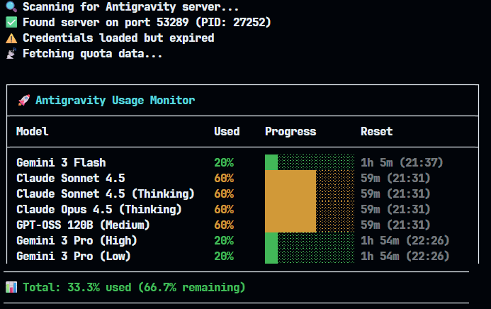

# Antigravity Usage Checker

[Tiếng Việt](README.vi.md)


[](https://github.com/tungcorn/antigravity-usage-checker/actions/workflows/ci.yml)
[](https://github.com/tungcorn/antigravity-usage-checker/actions/workflows/codeql.yml)



Check your Antigravity AI usage quota from the terminal.

Antigravity Usage Checker is a small Go command-line tool that reads quota information from the local Antigravity/Windsurf API and prints it in a terminal-friendly format.

## Important security warning

A malicious fork of this repository exists: `Motasem-amer/antigravity-usage-checker`.

That fork has distributed malware disguised as this tool by replacing the README with fake "Download Now" links that point to a ZIP file containing a Windows malware dropper.

Only download this tool from:

- **This repository**: [tungcorn/antigravity-usage-checker](https://github.com/tungcorn/antigravity-usage-checker)
- **Official releases**: [GitHub Releases](https://github.com/tungcorn/antigravity-usage-checker/releases)

Do not download this tool from forks or unofficial sources. If you already downloaded a copy from the fork above, scan your system immediately.

## Security model

This tool is designed to be transparent and safe:

- **Local API only**: It connects to the local Antigravity server on `127.0.0.1`.
- **No external runtime network calls**: The application does not send usage data to external servers.
- **No telemetry**: There is no tracking, analytics, or data collection.
- **Open source**: The code and install scripts are available for review.
- **Read-only behavior**: It reads local process information and quota data; it does not modify your Antigravity setup.

The install scripts download release assets from GitHub. Review `install.ps1` or `install.sh` before running them if you prefer.

## Requirements

- Antigravity must be running to fetch fresh quota data.
- Internet access is required only when using the installer or downloading releases.

## Quick install

### Windows

Run in PowerShell:

```powershell
iwr https://raw.githubusercontent.com/tungcorn/antigravity-usage-checker/main/install.ps1 -OutFile $env:TEMP\install.ps1; . $env:TEMP\install.ps1
```

If PowerShell blocks script execution, run:

```powershell
powershell -ExecutionPolicy Bypass -Command "iwr https://raw.githubusercontent.com/tungcorn/antigravity-usage-checker/main/install.ps1 -OutFile $env:TEMP\install.ps1; & $env:TEMP\install.ps1"
```

### macOS and Linux

Run in a shell:

```bash
curl -fsSL https://raw.githubusercontent.com/tungcorn/antigravity-usage-checker/main/install.sh | bash
```

Then run:

```bash
agusage
```

## Update

Run the install command again to update to the latest version.

## Install a specific version

### Windows

```powershell
powershell -ExecutionPolicy Bypass -Command "iwr https://raw.githubusercontent.com/tungcorn/antigravity-usage-checker/main/install.ps1 -OutFile $env:TEMP\install.ps1; & $env:TEMP\install.ps1 -Version 0.5.0"
```

### macOS and Linux

```bash
curl -fsSL https://raw.githubusercontent.com/tungcorn/antigravity-usage-checker/main/install.sh | bash -s -- -v 0.5.0
```

## Manual install

1. Download the latest release from [GitHub Releases](https://github.com/tungcorn/antigravity-usage-checker/releases/latest).

2. Choose the archive for your platform:

   - Windows: `antigravity-usage-checker-windows-amd64.zip`
   - macOS Intel: `antigravity-usage-checker-darwin-amd64.tar.gz`
   - macOS Apple Silicon: `antigravity-usage-checker-darwin-arm64.tar.gz`
   - Linux: `antigravity-usage-checker-linux-amd64.tar.gz`

3. Extract the archive.

4. Run the executable:

   - Windows: run `agusage.exe`
   - macOS/Linux: run `chmod +x agusage`, then `./agusage`

5. Optional: add the executable to `PATH`.

   Windows:

   1. Move `agusage.exe` to a folder such as `C:\Tools`.
   2. Press `Win + R`, type `sysdm.cpl`, and press Enter.
   3. Open **Advanced** > **Environment Variables**.
   4. Under **User variables**, select `Path` > **Edit** > **New**.
   5. Add the folder path and restart your terminal.

   macOS/Linux:

   ```bash
   sudo mv agusage /usr/local/bin/
   ```

   Or add a custom folder to `PATH` in `~/.bashrc` or `~/.zshrc`:

   ```bash
   export PATH="$PATH:/path/to/your/folder"
   ```

## Usage

```bash
agusage            # Show current quota
agu                # Short alias installed by the install scripts
agusage --json     # Output JSON
agusage -j         # Output JSON using shorthand
agusage --version  # Show version information
agusage --help     # Show help
```

## Features

- **Color-coded output**: Green, yellow, and red indicators based on remaining quota.
- **Smart total calculation**: Detects and deduplicates shared quota pools.
- **Unicode progress bars**: Displays quota usage with terminal progress bars.
- **Fast and lightweight**: Written in Go and distributed as a single binary.
- **Offline cache**: Can show cached quota data when Antigravity is not running.

## How it works

1. Finds the running Windsurf language server process.
2. Reads the local connection parameters from process arguments.
3. Calls the Antigravity local API on `127.0.0.1`.
4. Parses quota data and displays it in the terminal.

## Known limitations

The Antigravity local API usually updates usage statistics at milestone values such as 0%, 20%, 40%, 60%, and 80%.

This tool intentionally uses the safe, read-only local API. Other tools may show more granular percentages by hooking into internal IDE event streams or token counters, which is a different approach.

## Platform support

| Platform | Status |
| --- | --- |
| Windows | Fully tested |
| macOS | CI tested |
| Linux | CI tested |

## Contributing

For development setup, testing, and build instructions, read the [contributing guide](CONTRIBUTING.md).

## License

[MIT](LICENSE) © 2024-present
